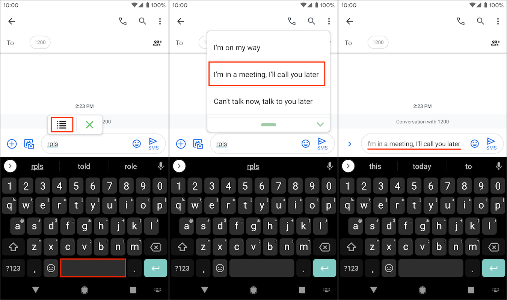

Updated: {docsify-updated}

# Getting started with Texpand

Learn how to setup and use Texpand.

## Enabling accessibility service

To start using Texpand you need to enable it in accessibility settings. 
 
When you first open Texpand you will see a warning that says "Accessibility service is disbaled" at the bottom of your screen, tap "Enable", this will bring up a dialog, tap the "Enable" button in the dialog.

Alternatively you can tap the three dots ( ⠇) on the top right corner and tap "Start service". 

You will then be directed to Android's accessibility settings, depending on your device you may find Texpand on this screen or you may find it under "Downloaded services" or "Installed services".

Once you find Texpand tap it, then tap the "Use service" switch, which will bring up a dialog that explains what permissions will Texpand get access to, tap "Allow". 

You have now enabled Texpand's accessibility service.

## Creating your first shortcut

To use Texpand you need to create shortcuts that will be replaced by a longer phrase such as an address, telephone number, email etc...

To create a shortcut open Texpand and tap the plus button at the bottom right corner, then tap "phrase" to begin creating your shortcut.

The phrase editor has two fields, the top text field is where you write your shortcut. The text field below is where you put your phrase. 

When you're done editing tap the back arrow at the top left corner to save your shortcut.

## Creating a phrase list

You can create a shortcut that displays a list of phrases when typed, for example you can create a list of replies to respond quickly when you're busy, then you can just type the shortcut and choose from the list of replies.

> <i class='bx bxs-crown' style="color: orange"></i> Phrase list is part of Texpand Premium.

To create a phrase list open Texpand and tap the plus button at the bottom right corner, then tap "Phrase list".

On the top text field of the phrase list editor type your shortcut, then tap "+ List item" to add a phrase, once you have added a phrase tap "+ List item" again to add another phrase, repeat to add more phrases.

Finally tap the back arrow at the top left corner to save your phrase list.

## Shortcut name restrictions

Shortcuts have the following restrictions:

- Shortcuts must be alphanumeric including unicode characters
- The follwoing symobols are allowed: ``*~^=+/\%'`&{}"<>?!-_,.@#$;:``
- Shortcuts can't contain emojis ☹️
- Shortcuts can't have spaces

## Using your shortcuts 

Once you have created your shortcuts you can use them in many apps. 

To use a shortcut start typing it, when the shortcut is typed Texpand will display a small window that displays small part of the phrase associated with the shortcut.

To insert the phrase you can tap space or you can tap the preview window.

 

You can also trigger text expansion by adding punctuation characters such as `,.:;?` after the shortcut, the punctuation character used to trigger the expansion will be appended to the end of the phrase.

To undo the expansion you can tap the backspace key in your keyboard.

Unfortunately Texpand is not compatible with every app, [Text Input Assistant](/text-input-assistant 'target=_self') can help you use your phrases in apps that are [incompatible](/known-issues?id=incompatible-applications 'target=_self') with Texpand.

### Using phrase lists

In case of phrase lists when you type your shortcut you will see a small list indicator(<i class="bx bx-list-ul"></i>) tap it to bring up the phrase list window, alternatively you can tap space. 

Once the phrase list window is displayed tap the phrase you want to insert.

You can move around the phrase list window using the handle at the bottom or you can close it using the chevron icon(<i class='bx bxs-chevron-down'></i>) in the bottom right.

> 💡 Swipe right on a phrase list item to open or share it with other applications

## Shortcut suggestions

When you have a lot of shortcuts, remembering all of them can be difficult, Texpand can help you find them without having to remember their exact spelling by displaying a shortcut suggestions window.

If what you're typing matches part of one or more shortcuts Texpand will display a small search icon, tapping the icon will display a list of shortcuts similar to the word you typed.

Tap the desired shortcut to insert it's phrase.

You can move around the suggestion window using the handle at the bottom or you can close it using the chevron icon(<i class='bx bxs-chevron-down'></i>) in the bottom right.

> 💡 Swipe right on a shortcut suggestion to edit the phrase, open or share it with other applications

## Adding notes to your phrases

You can add notes to your phrases, which can help describe the contents of a phrase. 

To add notes open a phrase and tap the three horizontal dots at the top right corner of the phrase editor, tap the "Add notes" text field to start adding your notes, once you are done close the phrase editor to save your note.

You can search for phrases using the contents of your notes.

## Opening your phrases with other applications

If your phrase is something that can be opened by another application such as a link or a phone number, you can open it from any other app that you're working on by tapping the icon that appears besides the phrase.

For example: If you have a shortcut for a phone number, you can call directly from any app that you're working on by typing the shortcut and tapping the dialer icon that appears in the phrase preview window, this can help save some time. 

> This feature is only available on Android 8 Oreo or later.

