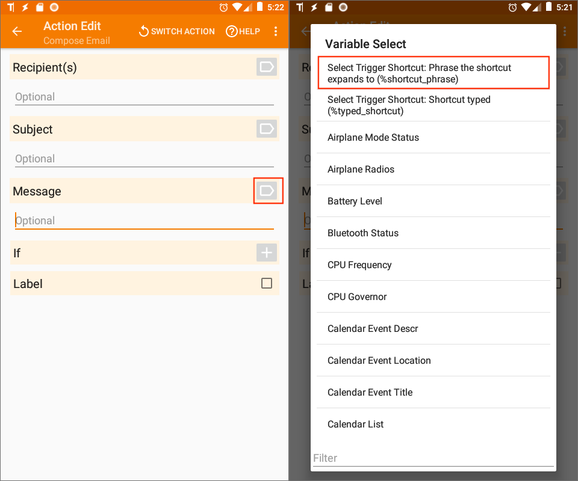
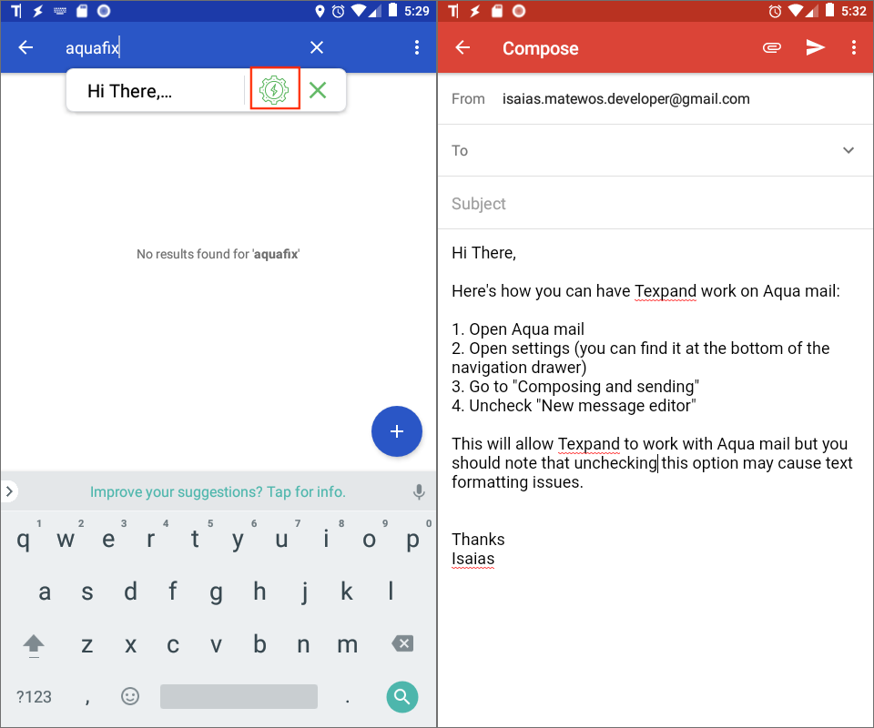

Updated: {docsify-updated}

# Tasker Support

Texpand allows you to use Tasker built-in and user created variables in your phrases, additionally you can trigger Tasker actions by typing a shortcut. 

In this page you will learn how to use Texpand's Tasker integration.

> <i class='bx bxs-crown' style="color: orange"></i> Tasker integration is part of Texpand premium.

> 💡 This guide assumes you have [Tasker](https://play.google.com/store/apps/details?id=net.dinglisch.android.taskerm&hl=en) installed and you are familiar with it's operation. It may be a bit more advanced for regular users.

## Using Tasker built-in variables

Tasker opens up a wide range of of  global built in
<a href="https://tasker.joaoapps.com/userguide/en/variables.html" target="_blank">variables</a>, you can use these variables in your phrases. Before you can use Takser built-in variables in your phrases you need configure Texpand plugin with Tasker, here's how:

1. Open Tasker and tap the '+' button to create a profile, then navigate to: *Event → Plugin -> Texpand → Request Tasker built-in variables update*

2. This will open a new screen titled "Event Edit" while in this screen tap the pencil button on the right side of "Configuration" label, then a plugin configuration screen will be come up then tap the switch to turn the plugin on, finally press the back button twice.

3. Tap "New Task +", Tasker will ask you to name it, give it a name to proceed.

4. This will open "Task Edit" screen, tap the '+' button on the bottom right, then navigate to: *Plugin → Texpand → Update built-in Tasker variables*

5. A new screen titled "Action Edit" will be opened, then tap the pencil button to the right of the "Configuration" label, in the screen that comes up, tap the switch to turn the action plugin on and go back to Tasker's profiles screen.

6. That's it, now you are ready to use Tasker built in variables in your phrases.

### Adding Tasker built-in variables to your phrases

1. Open Texpand and tap the '+' button then select either "Phrase" or "Phrase list"

2. Now move the cursor to either "phrase" or to "List item" in case of phrase lists, then the variable menu will appear above your keyboard.

3. Scroll horizontally to the right end of the variable menu until you see 'Tasker', once you see it tap 'Tasker' and select 'Built-in' then a dialog listing all Tasker built-in variables will be shown from here select the variable you want use, repeat this step to add more variables.

> To use your phrases with Tasker variables simply type the shortcut in a compatible application and the Tasker variables in the phrase should be replaced with thier respective values provided by Tasker.

## Tasker configuration for user variables

Texpand has support for Tasker's user created local variables. To demonstrate, here's an example that will allow you to fetch the current Bitcoin price and use the value in your phrases. 

You can also import this task <a href="https://taskernet.com/shares/?user=AS35m8kVZzyXnsJmz1SfMBXr%2BwhJbIG%2F%2Ff26SUe5pP3rZ3j7ECdpC1YJzSpBGW%2F8OKFd4Ll42qUApRki%2BnFiue7iUQ%3D%3D&id=Profile%3AUpdate+Bitcoin+Price+Every+15+Minutes" target="_blank">from here</a>.

Follow the following steps:

1. Open Tasker and tap the '+' button to create a profile and select "Time".

2. Tap "From" and "Until" to disable them, then select "Every" and type 15 in the text field next to "Every", after that change the time unit to "Minute(s)" and go back, this setup will trigger the task every 15 minutes. 

3. Tap "New Task +" and give the task a name to proceed, this will bring up a screen titled "Task Edit".

4. Tap the '+' button on the bottom right, then navigate to: *Net → Http Request*, this will open a screen titled "Action Edit".

5. Scroll down and you will find a text field titled "URL" then enter "https://blockchain.info/ticker" which is a site that provides bitcoin exchange rate data. Go back once you have entered the url.

6. Tap the '+' button on the bottom right, then navigate to: *Variables → Variable Set*.

7. In the text field titled "Name" enter `btc_exch_rate` without removing the '%', below there's another text field titled "To" simply enter a space here and go back. This will prepare a variable to hold the bitcoin exchange rate.

8. Tap the '+' button on the bottom right, then navigate to: *Code → Javascriptlet*

9. Under the text field titled "Code" enter the following javascript code `btc_exch_rate = JSON.parse(http_data).USD.last`, from and go back. This will extract the BTC to USD exchange rate the data.

10. Tap the '+' button on the bottom right and navigate to: *Plugin → Update Tasker user variables*

11. Tap the pencil button besides "Configuration" label, then a screen listing available variables will show up then check 'btc_exch_rate', this step will send the updated value of the variable 'btc_exch_rate' to Texpand when this task runs.

Now that the Task is setup go back from the "Task Edit" screen.

### Using local user created variables in your phrases

1. Open Texpand and tap the '+' button then select either "Phrase" or "Phrase list"

2. Now move the cursor to either "phrase" or to "List item" in case of phrase lists, then the variable menu will appear above your keyboard.

3. Scroll to the right end of the variable chooser toolbar until you see 'Tasker', once you see it tap it and select 'User vars' then a dialog listing available  variables will be shown from here select the variable you want use, repeat this step to add more variables. As per the above example 'btc_exch_rate' should show up here, if you select it Texpand will replace it with Bitcoin current exchange rate when expanding it using it's respective shortcut.

## How to trigger Tasker actions using Texpand shortcuts

You can use Texpand shortcut to trigger Tasker actions of your choosing. To demonstrate, the following steps will show how to have Tasker compose an email by using your phrase as a message:

1. Open Tasker and tap the '+' button to create a profile and select "Event".

2. Then navigate to *Plugin → Texpand → Select Trigger shortcut*

3. This will open "Event Edit" screen, then tap the pencil button on the right side of the "Configuration" label.

4. This will open a list of Texpand shortcuts, tap the desired shortcut and go back to Tasker start screen.

5. Tap "New Task +", Tasker will ask you to name it, give it a name to proceed.

6. This will open "Task Edit" screen, tap the '+' button on the bottom right, then navigate to: *Net → Compose Email* 

7. A new screen titled "Action Edit" will be opened, then locate the "Message"  label (third from the top) to it's right there is an a variables icon tap it, then choose the variable `%shortcut_phrase`, and go back to Tasker start screen.

To trigger the Tasker action type the shortcut you chose in step 4 and tap the gear icon that shows up in phrase preview: 

> 💡 If [phrase preview](/text-expansion-configuration?id=phrase-preview 'target=_self') is disabled you will not be able to trigger Tasker actions.
