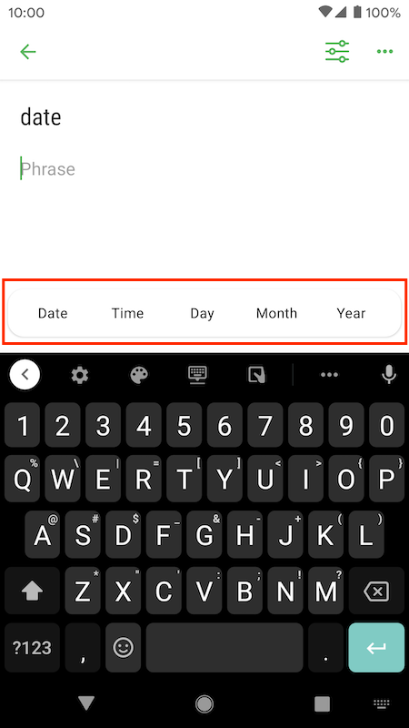
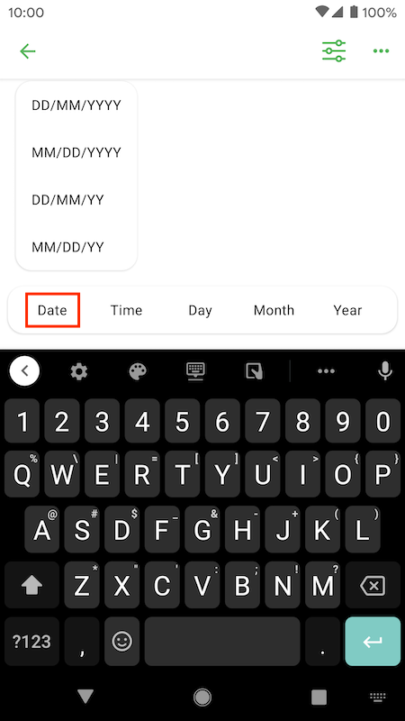
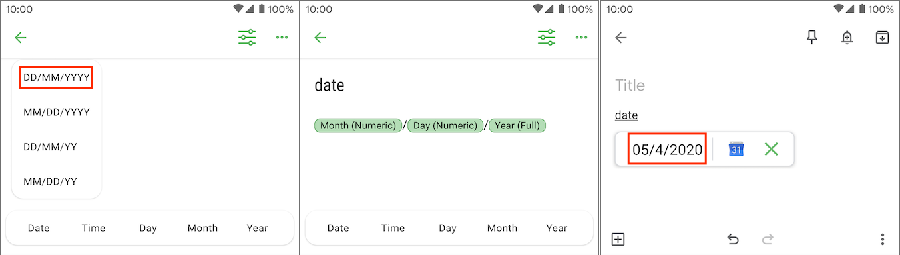

Updated: {docsify-updated}

# Texpand variables

Texpand variables make your phrases even more powerful, for example you can insert date/time, move the cursor, insert clipboard contents and more. 

This is a guide on how to add variables to your phrases and how to use them.

## Adding Texpand variables 

To add Texpand variables open the phrase editor, and tap on the phrase text field, if it's the phrase list editor tap on any list item, the variable menu will show up just over your keyboard.

	

Variables are organized in sub-menus by their type, e.g tapping the 'Date' button will bring up a menu of predefined date formats, tapping any of them will insert it to the phrase text field.

	

## Date/time variables

With variables you can insert predefined simple date/time formats or you can create custom date formats by using a combination of day, month, and year variables.

### Predefined date and time formats

To insert a predefined date formats, tap the "Date" button and select the date format you want, similarly to insert a predefined time format, tap the "Time" button choose the desired time format.

	

### Custom date and time formats

To insert custom date/time formats you have to construct them using the individual day, month, year, minute and second variables. 

The video below shows how to create a date like `Monday 4 May 2020, 06:00 PM`:

  <video autoplay="false" loop="false" width="300" src="img/custom_date_format_sm.mp4"
  	alt="How to insert custom date formats">

You can mix and match individual Texpand variables to create a lot of date/time formats. 

## Moving the cursor

You can use the cursor variable to move the cursor to specific position in your phrase after text expansion.

To insert the cursor variable, move the cursor to where you want it to be moved after text expansion, then scroll the variable menu horizontally and tap "Misc" and select "Cursor".

Here's a video:

  <video autoplay="false" loop="false" width="300" src="img/cursor_usage_fnl.mp4"
  	alt="How to move the cursor using Texpand variables">

>  Moving the cursor may not work properly in some applications

## Clipboard variable

You can insert contents of clipboard into your phrase by using the clipboard variable, to insert the clipboard variable scroll the variable menu horizontally and tap "Misc" then select "Clipboard". 

## All Texpand variables

- <b>Day</b>
	- Day (Numeric): represents a numeric form of a day, e.g `16`.
	- Day (Short name): a short day name such as `Mon`.
	- Day (Full name): full name of a day, e.g `Friday`.
- <b>Month</b>
	- Month (Numeric): numeric form of a month, e.g March would be `03`.
	- Month (Short name): short name of a month, e.g. `Jul`.
	- Month (Full name): full name of a month, e.g. `September`.
- <b>Year</b>:
	- Year (Short): represents a year in two digit form, e.g `20` for 2020.
	- Year (Full): a four digit year such as `2020`.
- <b>Hour</b>:
	- Hour (12): current hour in 12 hour format, e.g: `02`.
	- Hour (24): current hour in 24 hour format, e.g: `14`.
	- AM/PM: becomes `AM` or `PM` depending on the time of the day.
- <b>Misc</b>:
	- Minutes: minutes of the current hour.
	- Seconds: seconds of the current minute.
	- [Cursor](#moving-the-cursor): specifies the position where the cursor will be moved after text expansion
	- [Clipboard](#clipboard-variable): inserts current clipboard contents.
- <b>Tasker</b>: use even more variables in your phrases with [Tasker integration](/tasker-support ':target=_self').