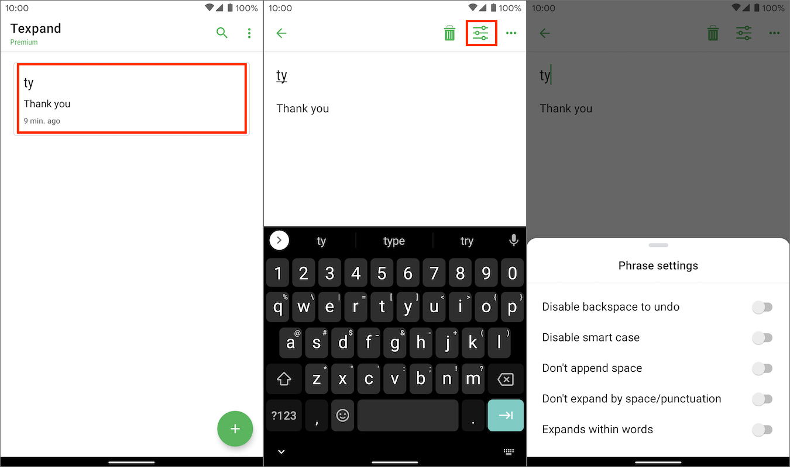

Updated: {docsify-updated}

# Configure Text Expansion

Learn how to configure text expansion to match your specific needs.

There are two ways to configure text expansion, **global settings** and [phrase settings](#phrase-settings).

## Global Settings

Global text expansion settings change the text expansion behavior of all your phrases, except those that have their own [settings](#phrase-settings). 

To find global text expansion settings go to: 

*Open Texpand → Menu (⠇) → Settings → Text Expansion* 

Global settings includes the following:

### Backspace to undo

If this is turned on tapping the backspace key (⌫) will change the expanded text back to the typed shortcut, helpful if you have mistakenly expanded a shortcut.

Turning it off will disable this behavior.

> 'Backspace to undo' does not work with phrases that have both [expand within words](#expands-within-words) and [expand instantly](#expand-instantly) enabled.

### Smart case

When turned on, smart case changes the expanded text case based on the case of the typed shortcut, example:

```
ty → thank you
Ty → Thank You
TY → THANK YOU
```

If smart case is disabled Texpand will expand the phrase as it is, without modifying it's case.

### Append space

If enabled Texpand will add a space at the end of the expanded text.


### Expand with space/punctuation

When enabled, this allows you to expand a shortcut by tapping space key or punctuation characters such as: `.,;:?`

If a punctuation character is used to expand a shortcut, it will be added to the end of the expanded text, example:

```
Hwr? → How are you?
Ty,  → Thank you, 
```

If this is disabled, you will have to tap [phrase preview](/README?id=phrase-preview) to insert your phrase.

> Phrases that have [expand within words](#expands-within-words) enabled can't be expanded by typing space/punctuation.


## Phrase Settings

Phrase settings allow you to change expansion behavior of specific phrases, regardless of [global settings](#global-settings).

To open phrase settings:




### Disable backspace to undo

Disables [backspace to undo](#backspace-to-undo) for a specific phrase.

### Disable smart case

Disables [smart case](#smart-case) for a phrase.

### Don't append space

Space won't be [appended](#append-space) when this phrase expands.

### Expand instantly

When enabled, shortcut will auto-expand as soon as it's typed. No need to tap space/punctuation. 

> If enabled, this will disable [phrase preview](/README?id=phrase-preview) for a phrase.

### Expands within words

This makes it possible to expand a shortcut in between characters, for example, assume you have a shortcut 'tn' that expands to 'tion', if this is enabled you can do this:

```
Fixatn   →   Fixation
Correctn →   Correction
```

## Application management

You can make Texpand work with all applications except certain applications (blacklist mode) or you can have it work only with selected applications (whitelist mode).

To choose between blacklist mode or white-list mode, go to:

*Open Texpand → Menu (⠇) → Settings → Text Expansion → Blacklisted apps* 

Then, tap "Mode" on the top right corner of the screen, and choose between "Blacklist mode" or "Whitelist mode".

To select applications for your preferred mode, tap the '+' button on the top, this will bring up a list of applications, tap an application to select, repeat to add more.


> When "Whitelist mode" is selected, you need to add at least one application to be applicable, otherwise text expansion will work in all applications.


## Overlay UI settings

Texpand displays small overlay windows to assist you with inserting your phrases, you can configure many aspects of these windows by going to:

*Open Texpand → Menu (⠇) → Settings → Appearance & Overlay UI* 

You can also change application theme and language in this screen.

Overlay UI settings include the following:

### Configure shortcut suggestions window

Texpand displays [shortcut suggestions](/README?id=shortcut-suggestions) to help you easily find your shortcuts. You can configure how shortcut suggestions work by going to: 

*Menu (⠇) → Settings → Appearance & Overlay UI → Suggestions* 

#### Show shortcut suggestions

Enable/disable shortcut suggestions.

#### Suggestion indicator threshold

Texpand lets you know that there are shortcuts similar to the word you're typing by displaying a small search icon (🔍).

By default Texpand starts searching for similar shortcuts when you type at least 2 characters of a word, this setting allows you change the amount of characters that need to be typed before Texpand starts searching for similar shortcuts.

### Max shortcut suggestions to show

This setting determines how many shortcuts are displayed at once in the shortcut suggestion window. 

You can configure Texpand to display up to 6 shortcut suggestions.

## Configure phrase list window

Customize the [phrase list](/getting-started?id=creating-a-phrase-list ':target=_self') window, you can find the the settings by going to: 

*Menu (⠇) → Settings → Appearance & Overlay UI → Phrase list* 


### Tap space to show phrase list window

When this is enabled, you can tap space after typing a shortcut associated with a phrase list to see the phrase list items. 

If this is disabled you will have to tap the small list icon (<i class="bx bx-list-ul"></i>) to show a phrase list window.

### Max phrase list items to show

Use this setting to specify how many phrase list items are displayed at once in the phrase list window. 

You can configure Texpand to display up to 6 phrase list items.


## Extras

Additional overlay UI settings.

### Overlay UI timeout

Specifies how long (in seconds) overlay windows will be displayed before they are automatically closed. 

This only applies to: phrase previews, shortcuts suggestion indicator (🔍) and phrase list indicator (<i class="bx bx-list-ul"></i>)

> All overlay windows will be closed when 		you navigate to another screen or tap another UI element.


### Overlay UI opacity

This settings allows you to change the transparency of overlay windows, by default they are opaque. This settings ranges from very transparent (5) to opaque (10).


