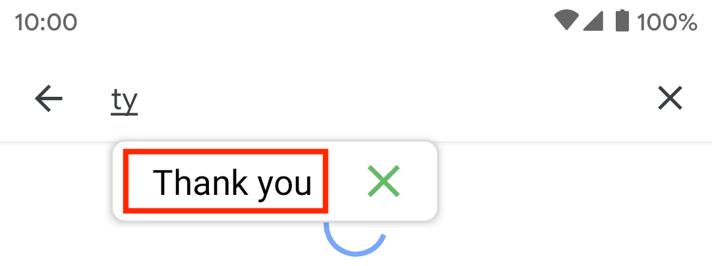

# Configure Text Expansion

Learn how to configure text expansion to match your specific needs.

There are two ways to configure text expansion, **global settings** and **phrase settings**.

## Global Settings

Global text expansion settings change the text expansion behavior of all your phrases, except those that have their own [settings](#phrase-settings). 

To can find global text expansion settings go to: 

*Open Texpand → Menu (⠇) → Settings → Text Expansion* 

### Backspace to undo

If this is turned on tapping the backspace key (⌫) will change the expanded text back to the typed shortcut, helpful if you have mistakenly expanded a shortcut.

Turning it off will disable this behavior.

### Smart case

When turned on, smart case changes the expanded text case based on the case of the typed shortcut, example:

```
ty → thank you
Ty → Thank you
TY → THANK YOU
```

If smart case is disabled Texpand will expand the phrase as it is, without modifying it's case.

### Append space

If enabled Texpand will add a space at the end of the expanded text.


### Expand with space/punctuation

When enabled, this allows you to expand a shortcut by tapping space key or punctuation characters such as `.;:?`.

If punctuation characters are used to expand a shortcut, it will be added to the end of the expanded text, example:

```
Hwr? → How are you?
Ty,  → Thank you, 
```

If this is disabled, you will have to tap the phrase preview to expand text:



If both [phrase preview](#phrase-preview) and "Expand with space/punctuation" are disabled, shortcuts will expand immediately without any user interaction.


## Phrase Settings

Phrase settings allow you to change expansion behavior of specific phrases, regardless of [global settings](#global-settings).

To open phrase settings:


### Disable backspace to undo

Disables [backspace to undo](#backspace-to-undo) for a specific phrase.

### Disable smart case

Disables [smart case](#smart-case) for a specific phrase.

### Don't append space

Space won't be [appended](#append-space) when this phrase expands.

### Don't expand by space/punctuation

[Space or punctuation](#expand-with-spacepunctuation) won't trigger expansion for this phrase.

### Expands within words

This makes it possible to expand a shortcut in between characters, for example let's you have a shortcut 'tn' that expands to 'tion', if this setting is enabled you can do this:

```
Fixatn → Fixation
Correctn → Correction
```

## Overlay UI settings

Texpand displays small overlay windows to assist you with inserting your phrases, you can configure many aspects of these windows by going to:

*Open Texpand → Menu (⠇) → Settings → Appearance & Overlay UI* 

You can also change application theme and language in this screen.


### Phrase preview

Phrase previews shows you a small part of the phrase that's about to be inserted when you type a shortcut, you can also [open a phrases](/getting-started?id=opening-your-phrases-with-other-applications) with other applications by tapping the the icon that appears besides the phrase.

If you don't want to to see phrase previews, you can uncheck this setting.

>💡 You can open the phrase editor by long pressing the phrase window to easily make changes to your phrase


### Configure shortcut suggestions 

Texpand displays [shortcut suggestions](/README?id=shortcut-suggestions) to help you easily find your shortcuts. You can configure how shortcut suggestions work by going to: 

*Menu (⠇) → Settings → Appearance & Overlay UI → Suggestions* 

#### Show shortcut suggestions

Enable/disable shortcut suggestions.

#### Suggestion indicator threshold

By default Texpand lets you know that there are shortcuts similar to the words you're typing by displaying a small search icon (🔍).

Texpand starts searching for similar shortcuts when you type at least 2 characters of a word, this setting allows you change the amount of characters that need to be typed before Texpand starts searching for similar shortcut.

### Max shortcut suggestions to show

This setting determines how many shortcuts are displayed at once in the shortcut suggestion window. You can configure Texpand to display up to 6 shortcut suggestions.


