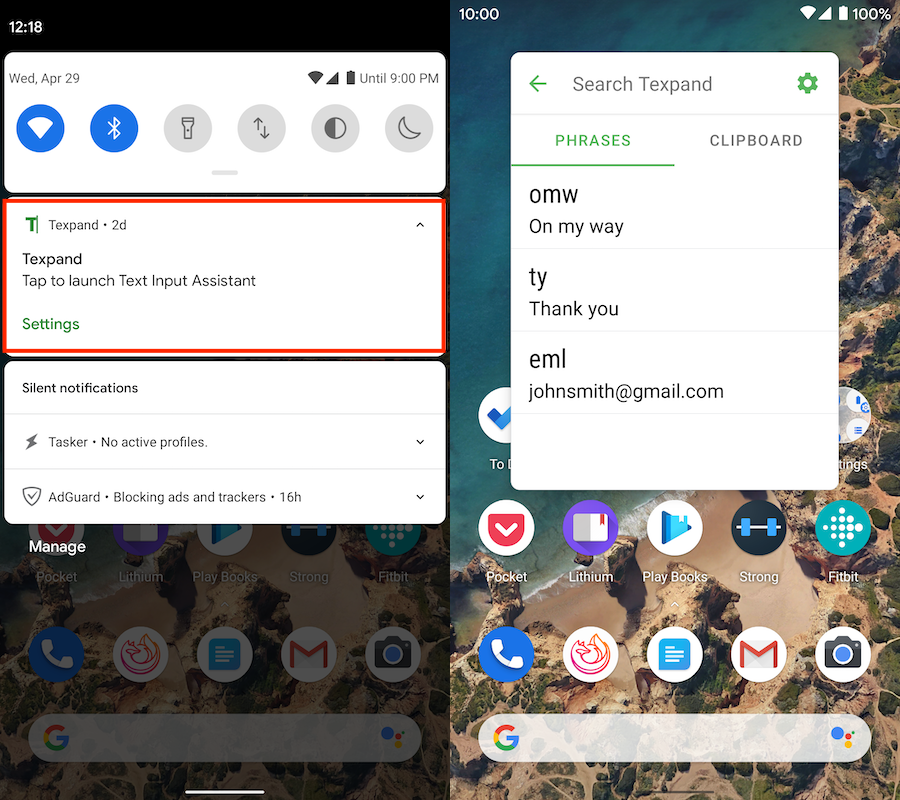
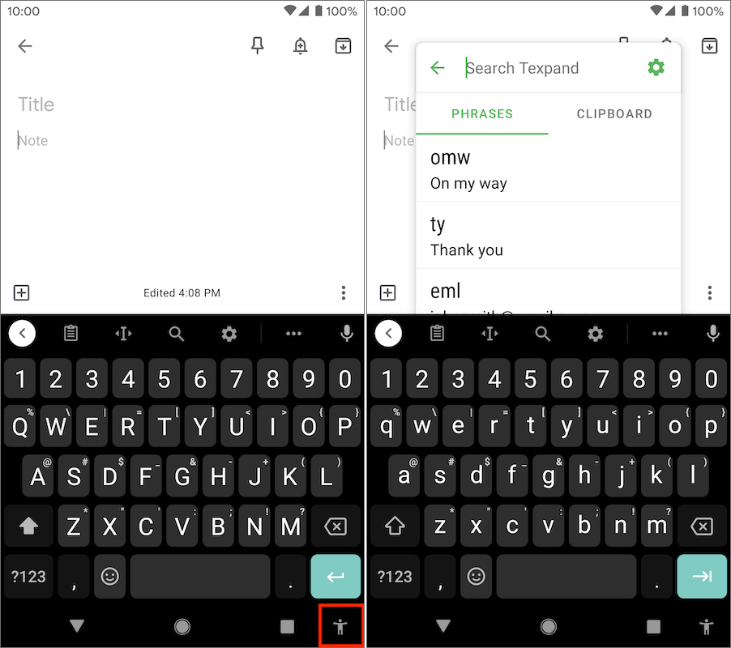
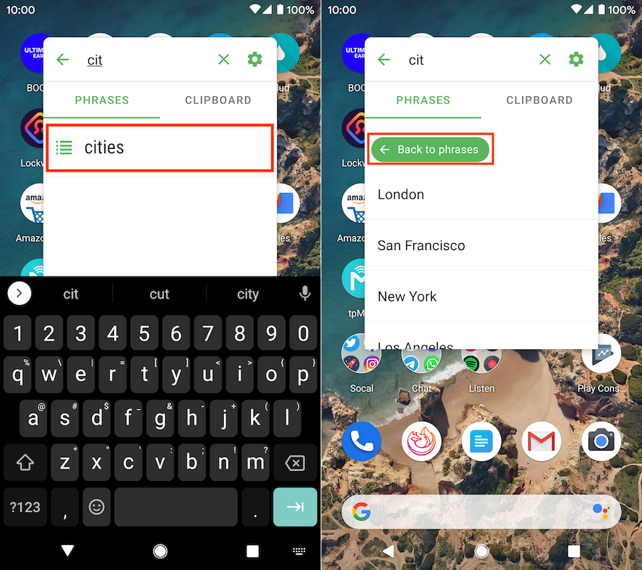
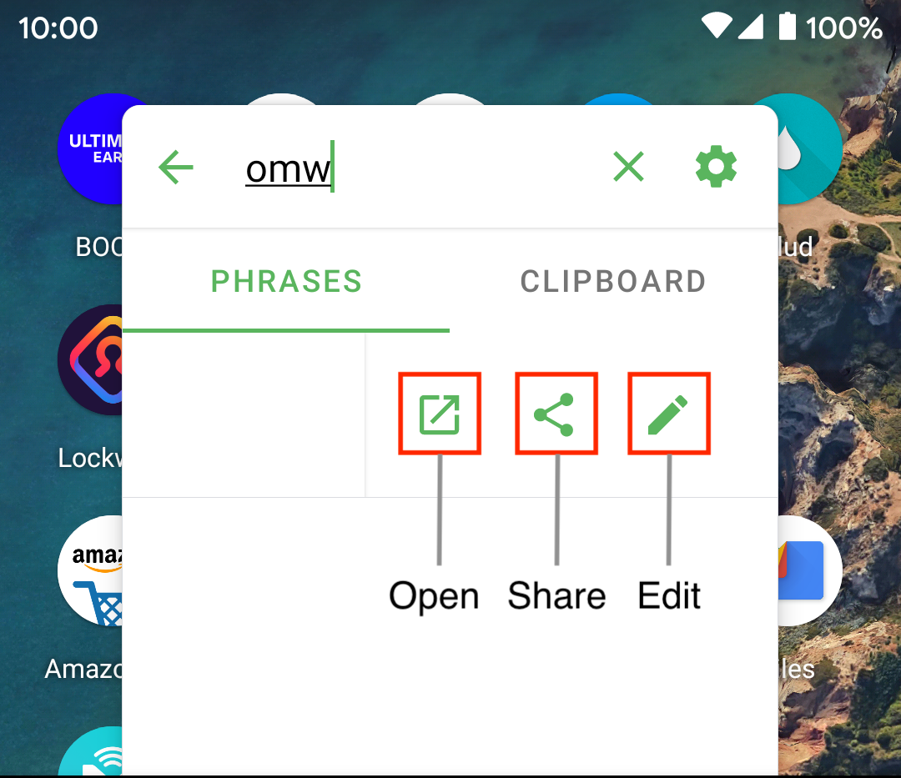
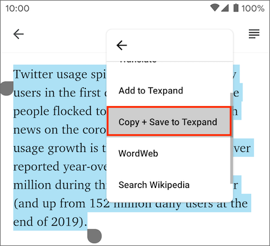
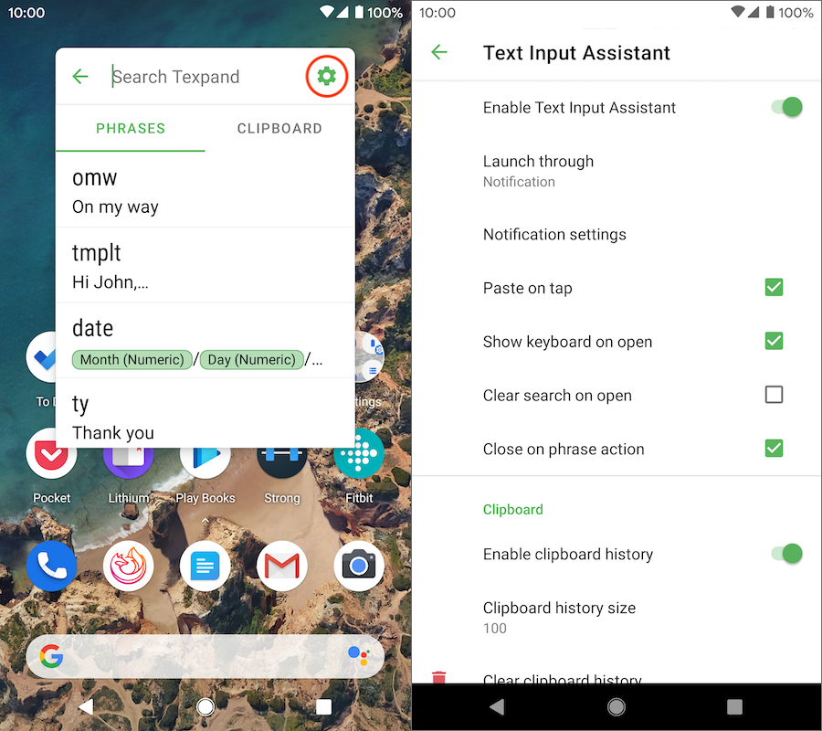

Updated: {docsify-updated}

# Text Input Assistant

Text Input Assistant (TIA) allows you to easily use your phrases from anywhere without opening Texpand, it makes it possible to use your phrases in applications where Texpand doesn't normally work.

## How to open

There are several ways to open TIA.

You can choose how to open TIA by going to:

*Open Texpand → Menu (⠇) → Settings → Text Input Assistant → Launch through* 

The available options are:

• <b>Notification</b>: allows you to open TIA by displaying an ongoing notification, tap it to open TIA.



• <b>Accessibility Button</b>: this is a system provided button that is displayed at the navigation area of your phone. You can use this button to show/hide TIA.



>In Android 10, when Google's gesture navigation is enabled, this button is replaced by a gesture, swipe up from the bottom of the screen with two fingers to show/hide TIA.

• <b>Fingerprint gesture</b>: allows you to show/hide TIA by a fingerprint gesture. By default a swipe up fingerprint gesture will show/hide TIA, but you can choose a fingerprint gesture direction by going to:

*Open Texpand → Menu (⠇) → Settings → Text Input Assistant → Fingerprint gesture direction*

> If your device have a fingerprint gesture to perform other actions, e.g pulling down the notification shade in Pixel phones, choosing to open TIA via a fingerprint gesture will disable this functionality. And it may not work at all in some devices


> ⚠️ Choosing to open TIA by accessibility button or fingerprint gesture requires [re-enabling](/getting-started?id=enabling-accessibility-service ':target=_self') Texpand accessibility service to fully take effect.


• <b>Quick settings tile</b>: additionally TIA can be opened by adding a quick settings tile. Here's how to do that:

<p align="center" style="margin-top: 60px; margin-bottom: 60px;">
  <video autoplay="false" loop="false" width="240" src="img/quick_settings_tile.mp4"
  	alt="How to add Text Input Assistant's quick setting tile">
</p>


## Searching for items

To search for items, simply start typing when TIA shows up, you can  switch between the "Phrases" and "Clipboard" to see their respective search results.

If you have [disabled](#show-keyboard-on-open) the keyboard from showing up when TIA is opened, tap the search field to begin searching.

## Accessing phrase list items

To see phrase list contents tap it, to go back to the main list tap the "Back to phrases" button at the top.



## How to use TIA

Learn how to use Text Input Assistant. 

The methods detailed below apply to all items you can access in TIA: phrases, phrase-lists and entries in the clipboard tab.


### Copy/paste phrases

To copy an item in TIA simply tap it, and Texpand will try to paste the the item if there's a focused text field beneath TIA. 

Otherwise you can manually paste the copied item in any text field you want.

<p align="center" style="margin-top: 60px; margin-bottom: 60px;">
  <video autoplay="false" loop="false" width="240" src="img/paste_action_docs.mp4" alt="How to copy/paste text using Text Input Assistant">
</p>

Pasting can be can [disabled](#paste-on-tap) in TIA's settings.


### Drag and drop phrases

You can drag and drop an item to an application beneath TIA, like this:

<p align="center" style="margin-top: 60px; margin-bottom: 60px;">
  <video autoplay="false" loop="false" width="240" src="img/drag_n_drop_outlook.mp4" alt="How to copy/paste text using Text Input Assistant">
</p>

> Drag and drop may not work with some applications

### Additional actions


You can swipe right on any item to bring up more actions.

<p align="center">
  
</p>


- <b>Open</b>: open the item with another application e.g if it's an email address it launches a compose screen in your default email client. See [opening a phrase](/getting-started?id=opening-your-phrases-with-other-applications).

- <b>Share</b>: share the item's contents with another application using the share menu.

- <b>Edit</b>: bring up the phrase editor, so that you can modify to the selected phrase/phrase-list.

> When you swipe right on clipboard entries, the edit action is replaced by delete action.

## Clipboard Manager

TIA can be used as a clipboard manager, in Android 9 (Pie) and earlier it's enabled by default so that everything you copy will appear in the clipboard tab. You can disable clipboard monitoring by going to:

*Open Texpand → Menu (⠇) → Settings → Text Input Assistant → Clipboard → Enable clipboard history* 

### Clipboard access in Android 10

Android 10 does not allow applications running in the background to access clipboard contents, you can bypass this restriction by granting additional permission to Texpand via [ADB](https://wiki.lineageos.org/adb_fastboot_guide.html). 

To enable clipboard history in Android 10 first enable clipboard history by going to:

*Open Texpand → Menu (⠇) → Settings → Text Input Assistant → Clipboard → Enable clipboard history* 

Then run the following ADB commands:

```
adb shell pm grant com.isaiasmatewos.texpand  android.permission.READ_LOGS
adb shell am force-stop com.isaiasmatewos.texpand
```

> ⚠️ The second ADB command will force stop Texpand as a result you will have to open Texpand and [enable its's accessibility service.](/getting-started?id=enabling-accessibility-service ':target=_self') 

#### Alternative method

If you're not comfortable with ADB commands or you would not like to give Texpand additional permissions, you can select a text and *tap more (⠇) → Copy + Save to Texpand*, this will copy the selected text and save it in Texpand.

<p align="center">
  
</p>


### Delete clipboard history

To delete your entire clipboard history, open TIA and tap the gear icon (<i class='bx bxs-cog' ></i>) at top right corner, this will open TIA's settings then scroll to the "Clipboard" section and tap "Clear clipboard history", this will display a prompt at the bottom of screen then tap "Yes".

To delete a specific clipboard history item open TIA and go to the clipboard tab, after that swipe right on the item you want to delete and tap the trashcan icon (<i class='bx bxs-trash'></i>) to delete it.

## Configure Text Input Assistant

You can find TIA settings by tapping the gear icon(<i class='bx bxs-cog' ></i>) at top right corner of TIA.




### Enable Text Input Assistant

Enable/disable Text Input Assistant. 

> ⚠️ If you have configured TIA to be opened by [accessibility button](#acessibility-button) or [fingerprint gesture](#fingerprint-gesture) you have to [re-enable](/getting-started?id=enabling-accessibility-service ':target=_self')  Texpand accessibility service for the setting to fully take effect.

### Launch through

Choose [how to open TIA.](#how-to-open)

> ⚠️ Choosing to open TIA by [accessibility button](#acessibility-button) or [fingerprint gesture](#fingerprint-gesture) requires [re-enabling](/getting-started?id=enabling-accessibility-service ':target=_self') Texpand accessibility service to fully take effect.

### Notification settings

If you choose to open TIA via an [ongoing notification](#notification), tap this setting to configure various aspects of the notification.

### Fingerprint gesture direction

When you choose to open TIA using a fingerprint gesture, this setting allows you to specify the direction of the fingerprint gesture.


### Paste on tap

Enable/disables [pasting](#copypaste-phrases) copied text to a focused text field beneath TIA.

### Show keyboard on open

If enabled focuses the search field and displays the soft keyboard so that you can start searching as soon as TIA opens.

### Clear search on open 

When enabled clears the search field when TIA shows up.

### Enable clipboard history

Enables/disables clipboard monitoring, in Android 10 enabling clipboard history requires [additional steps.](#clipboard-access-in-android-10)

### Clipboard history size

Specify the amount of clipboard history to keep, free version of Texpand is limited to 15 entries.

### Clear clipboard history

Tap this to delete the [entire clipboard history.](#delete-clipboard-history)
