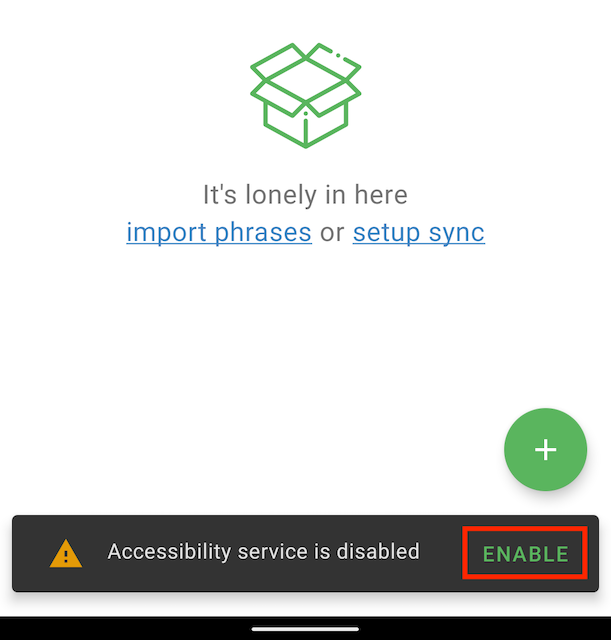
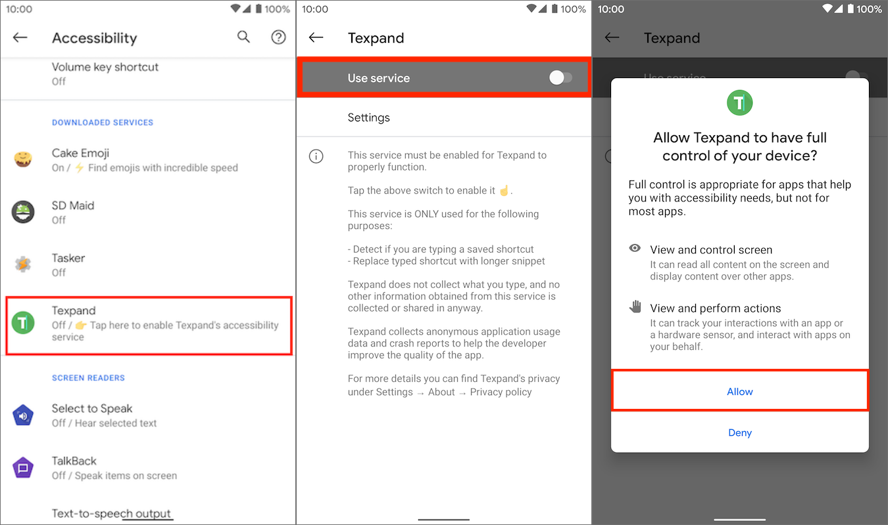
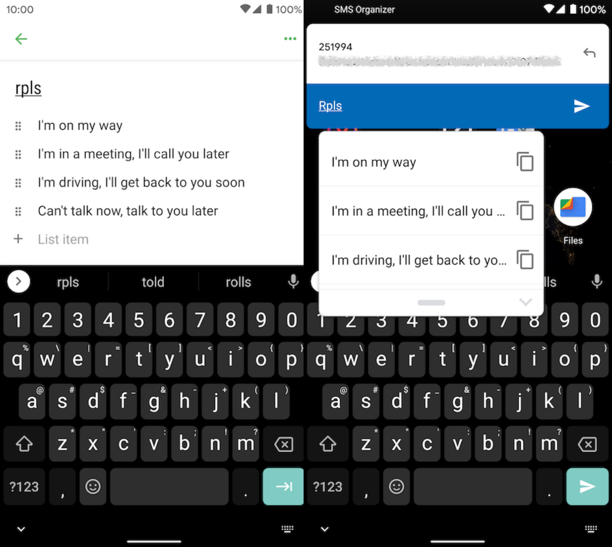
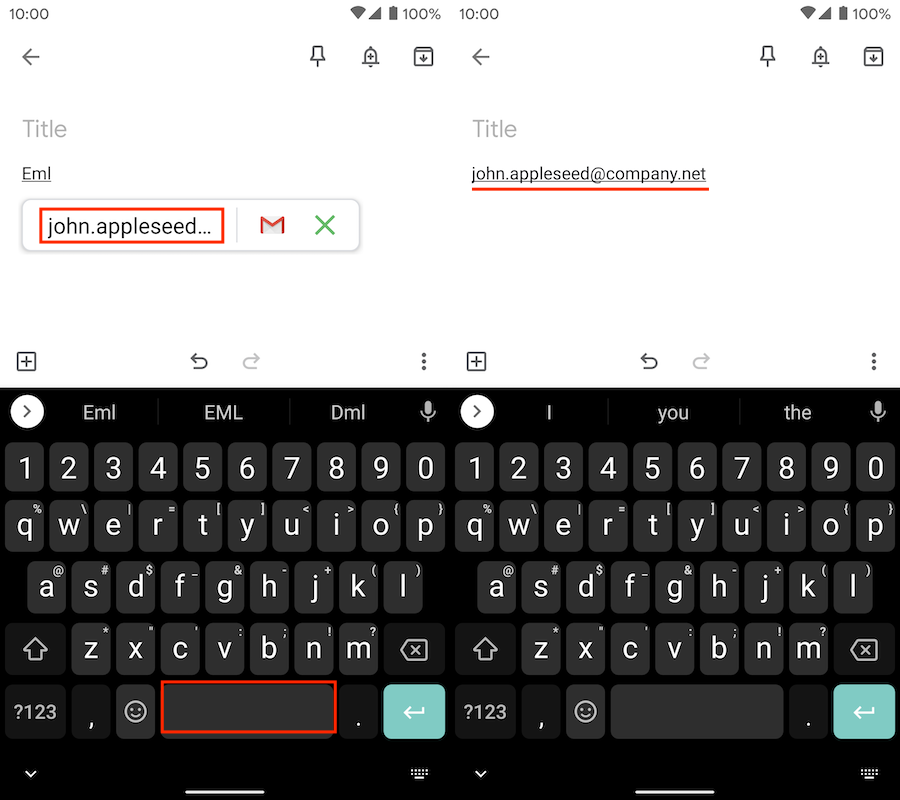
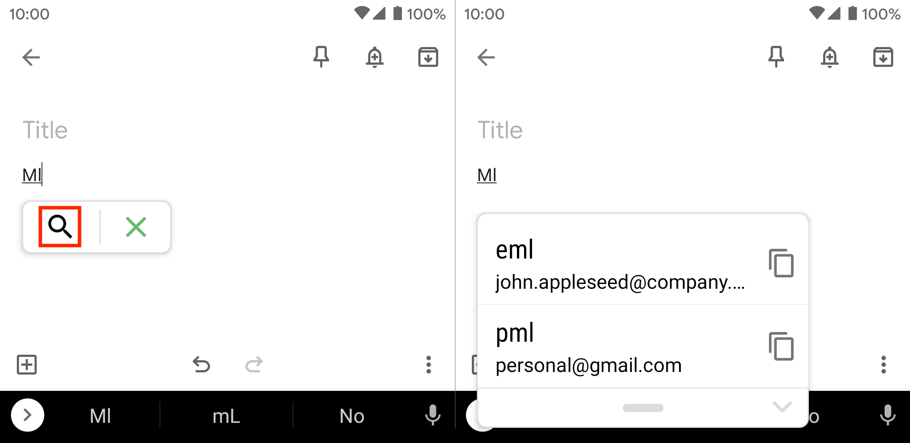

# Getting started with Texpand

Learn how to setup and use Texpand.

## Enabling Texpand's accessibility service

Texpand requires it's accessibility service to be enabled to function. When you first open Texpand, it will ask you enable it's accessibility service: 

Tap the "enable" button, a dialog will appear explaining Texpand needs you to enable the accessibility service, tap "enable" again. Alternatively you can tap the three dots on the top right corner and tap "start service". 

You will then be directed to Android's accessibility settings, depending on your device you may find Texpand on this page or you may find it under "Downloaded services" or "Installed services".

Once you find Texpand tap it, then tap the "Use service" switch, it will bring up a dialog that explains what permissions will Texpand get access to, tap "Allow". This will enable Texpand's accessibility service.

## Creating your first shortcut

To use Texpand you need to create shortcuts that will be replaced by longer snippets such as an address, telephone number, email etc...

To create a shortcut open Texpand and tap the plus button at the bottom right corner, then tap "phrase" to create a phrase.

The phrase editor has two fields, the top text filed is where you write your shortcut, this should be something simple and easy to remember, your longer snippet goes in the text field below, after you have finished editing tap the back arrow at the top left corner to save it.

## Creating a phrase list

Phrase lists allow you to create a list of snippets that can be displayed by typing one shortcut, for example you could create a list of replies to send quickly when you're busy. 

Then you can type the shortcut and choose from the list of replies.

Phrase list is part of Texpand Premium.

## Shortcut name restrictions

Shortcuts have the following restrictions:

- Shortcuts must be alphanumeric including unicode characters, 
- Allowed symbols: ``*~^=+/\%'`&{}"<>?!-_,.@#$;:``
- Shortcuts can't contain emojis ☹️
- Shortcuts can't have spaces

## Using your shortcuts 

Once you have created your shortcuts you can use them in many apps, unfortunately Texpand is not compatible with every app, please refer to this page to learn more about Texpand's limitations and how you can overcome them. 

To use a shortcut start typing it, when the shortcut is typed Texpand will display a small window to take peek at the snippet associated with the shortcut.

To insert your snippet you can tap space after the shortcut or you can tap the preview window.

You can also trigger text expansion by adding punctuation characters such as `,.:;?` after the shortcut, the punctuation character used to trigger the expansion will be appended to the end of the snippet.

To undo the expansion you can tap the backspace key in your keyboard.

## Snippet suggestions

If you have a lot of shortcuts remembering all of them can be difficult, Texpand can help you find them without having to remember ther exact spelling. 

If what you're typing matches part of one or more shortcuts Texpand will display a small search icon, tapping it will display a list of shortcuts similar to the word you just typed.

Tap the desired shortcut to insert it.

## Opening your snippets with other apps

If your snippet is a type of text that can be handled by another app such as a link, email, or telephone number you can easily open it by tapping the app icon the appears besides the snippet preview. 

For example if you call a specific number frequently you can create a shortcut for it and dial directly from any app by typing the shortcut and tapping the dialer icon the will appear in the snippet preview window, this will save you a lot of taps and time. 

This feature is only available on Android 8 Oreo or later.

## Next steps

- Customize Text Expansion
- Insert dates and other variables
- Keeping your data safe
- Using Texpand in incompatible apps
- Tasker support

